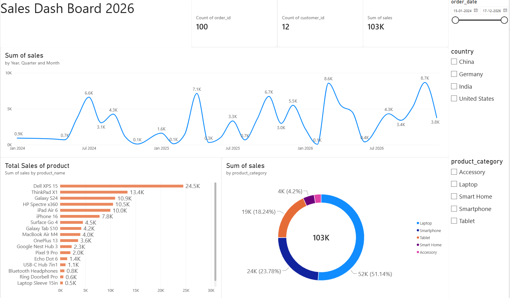

# Sales Data Analysis Dashboard - Power BI

## Project Overview

This is a guided Power BI project completed as part of my learning and development in data analytics. The project focuses on analyzing sales data and presenting key information through an interactive Power BI dashboard.

## Tools Used

- Microsoft Power BI
- Power Query
- Data Visualization

## What I Practiced

- Importing and preparing data for analysis
- Data cleaning and transformation
- Creating interactive dashboard visualizations
- Using filters and slicers
- Analyzing sales performance and trends
- Presenting information through a structured dashboard

## Dashboard Preview

## Key Insights

- Total sales of approximately 103K were recorded across 100 orders and 12 customers.
- Dell XPS 15 generated the highest product-level sales at approximately 24.5K.
- Laptops contributed the largest share of total sales at approximately 51%.
- Sales fluctuated over the analyzed period, with several noticeable peaks in monthly performance.

## Project File

The Power BI (.pbix) project file is included in this repository.

## Note

This project was completed as a guided learning project based on a YouTube tutorial and recreated for hands-on practice with Power BI.
